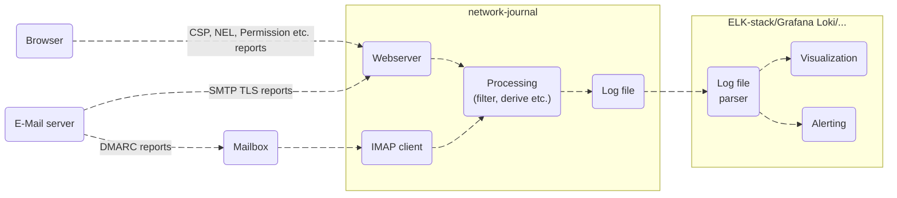

# network-journal


This project is about handling all the reports browsers (Content Security Policy, Network Error Logging etc.) and e-mail servers (DMARC, SMTP TLS etc.) can send nowadays.

To do that, this project contains a webserver, that will listen to incoming reports, validate them, filter them, structure them and log them to a file. 
This log file can be read by your log monitoring tools like an ELK-stack or Grafana Loki. 
With that, you can generate diagrams, configure alerts, you name it.



## :white_check_mark: Current State

### Supported Reports

- [x] [COEP](https://html.spec.whatwg.org/multipage/browsers.html#coep) ([MDN](https://developer.mozilla.org/en-US/docs/Web/HTTP/Reference/Headers/Cross-Origin-Embedder-Policy))
- [x] [COOP](https://html.spec.whatwg.org/multipage/browsers.html#cross-origin-opener-policies) ([MDN](https://developer.mozilla.org/en-US/docs/Web/HTTP/Reference/Headers/Cross-Origin-Opener-Policy))
- [x] [Crash Reports](https://wicg.github.io/crash-reporting/) (in a context of websites)
- [x] Content Security Policy (Level 1, [2](https://www.w3.org/TR/CSP2/) and [3](https://www.w3.org/TR/CSP3/)) reports ([MDN](https://developer.mozilla.org/en-US/docs/Web/HTTP/Guides/CSP))
- [x] [Deprecations](https://wicg.github.io/deprecation-reporting/) (in a context of websites)
- [x] [Network Error Logging](https://www.w3.org/TR/network-error-logging/) ([MDN](https://developer.mozilla.org/en-US/docs/Web/HTTP/Guides/Network_Error_Logging))
- [x] [SMTP TLS Reports](https://www.rfc-editor.org/rfc/rfc8460)
- [x] [DMARC aggregate reports](https://www.rfc-editor.org/rfc/rfc7489.html)
- [x] [Permissions Policy](https://w3c.github.io/webappsec-permissions-policy/)
- [x] [Integrity Policy](https://w3c.github.io/webappsec-subresource-integrity/)
- [x] [Intervention Reports](https://wicg.github.io/intervention-reporting/)

### Supported Report Handling

- [x] Webserver listening to incoming reports
- [x] Report validation
- [x] Filtering by your own domains to prevent spam
- [x] Derive additional metrics from...
    - [x] user agent (browser name and version, OS name and version etc.)
    - [x] origin/document URLs (host, path, query)
- [x] Log reports to file

### Supported Installation Methods

- [x] Build from source
- [x] Provide [systemd service file](pkg/network-journal.service)
- [x] RPM package
- [ ] DEB package

## :rocket: Install

### Installation methods

There are several installation methods available:

#### RPM Package (RHEL/CentOS/AlmaLinux/Rocky Linux)

1. Download the latest RPM package from the [releases section on GitHub](https://github.com/nerou42/network-journal/releases/latest).
  Currently, RPM packages are available for *el9* and *amd64 architecture* only. If you need a package for another version/arch, please file an issue.
1. Install it using `sudo dnf install network-journal-*.el9.x86_64.rpm`
1. Configure by editing `/etc/network-journal/network-journal.yml`
1. Run `sudo systemctl enable --now network-journal` to start the server

#### Precompiled Binary

1. Download the latest binary from the [releases section on GitHub](https://github.com/nerou42/network-journal/releases/latest).
  Currently, binaries are available for *Linux* and *amd64 architecture* only. If you need one for another OS/architecture, please file an issue.
1. Move the binary to a path of your liking e.g. `mv network-journal-*-linux-x86_64 /usr/local/bin/network-journal`

#### Build from Source

1. Install the Rust toolchain: [Install Rust](https://www.rust-lang.org/tools/install)
1. Clone the repository `git clone https://github.com/nerou42/network-journal.git && cd network-journal`
1. Run `cargo build -r` (`cargo` is part of the Rust toolchain)
1. Move the executable to a path of your liking e.g. `mv target/release/network-journal /usr/local/bin/`

### Configuration ("Precompiled Binary" and "Build from Source" only)

Run the executable once (with the `--config` parameter set to a path of your liking) to generate the default configuration file like so: `network-journal --config /etc/network-journal.yml`

Edit the generated configuration file. See [network-journal.reference.yml](network-journal.reference.yml) file for documentation.

:exclamation: **Note**: Some reporters require TLS to be enabled. If you are using some reverse proxy on the other hand, you do not need to enable TLS in this context but on your proxy.

## :bar_chart: Configure your reports

In the following, `network-journal.example.com` needs to be replaced with your network-journal domain while `example.com` needs to be replaced with your frontend or e-mail domain respectively.

:exclamation: **Note**: All `Reporting-Endpoints` headers discussed below should be combined into one like so `Reporting-Endpoints: crash-reporting="...", "csp-endpoint="..."` or even `Reporting-Endpoints: default="https://network-journal.example.com/reporting-api"`. The same should be done for the `Report-To` header like so `Report-To: {"group": ...}, {"group": ...}`.

### COEP

Add the following HTTP headers to your HTTP responses:

1. `Cross-Origin-Embedder-Policy: [...]; report-to="coep"`
1. `Report-To: {"group": "coep", "max_age": 2592000, "endpoints": [{ "url": "https://network-journal.example.com/reporting-api" }]}`

### COOP

Add the following HTTP headers to your HTTP responses:

1. `Cross-Origin-Opener-Policy: [...]; report-to="coop"`
1. `Report-To: {"group": "coop", "max_age": 2592000, "endpoints": [{ "url": "https://network-journal.example.com/reporting-api" }]}`

### Crash

Add the following HTTP header to your HTTP responses:

`Reporting-Endpoints: crash-reporting="https://network-journal.example.com/reporting-api"`

### CSP (Content Security Policy)

Add the following HTTP headers to your HTTP responses:

1. `Reporting-Endpoints: csp-endpoint="https://network-journal.example.com/reporting-api"`
1. `Content-Security-Policy: [...]; report-to csp-endpoint`
    Since `report-to` is not yet supported by all browsers, you probably should do the following instead:
    `Content-Security-Policy: [...]; report-to csp-endpoint; report-uri https://network-journal.example.com/csp`

### Deprecation

Add the following HTTP header to your HTTP responses:

`Reporting-Endpoints: default="https://network-journal.example.com/reporting-api"`

Note: At time of writing, deprecation reports are always delivered to the "default" endpoint.

### DMARC

Add a DMARC DNS entry with a `rua` tag to send aggregate reports to some mailbox (it is recommended to create a mailbox solely for this purpose).
Set the credentials for this mailbox in the configuration file.

### Integrity Policy

Add the following HTTP header to your HTTP responses:

`Reporting-Endpoints: integrity-endpoint="https://network-journal.example.com/reporting-api"`

Note: You could also define a different endpoint and link it to your `Integrity-Policy` header using the `Integrity-Policy: blocked-destinations=..., endpoints="my-integrity-endpoint"` syntax.

### Intervention Policy

Add the following HTTP header to your HTTP responses:

`Reporting-Endpoints: default="https://network-journal.example.com/reporting-api"`

Note: At time of writing, intervention reports are always delivered to the "default" endpoint.

### NEL (Network Error Logging)

Add the following HTTP headers to your HTTP responses:

1. `Report-To: { "group": "nel", "max_age": 31556952, "endpoints": [{ "url": "https://network-journal.example.com/nel" }]}` (deprecated) or
    `Reporting-Endpoints: nel="https://network-journal.example.com/reporting-api"` (not yet supported by all browsers)
1. `NEL: { "report_to": "nel", "max_age": 31536000, "include_subdomains": true }`

### SMTP TLS

Add the following DNS entry for your domain:

`_smtp._tls.example.com IN TXT "v=TLSRPTv1; rua=https://network-journal.example.com/tlsrpt"`

## :clipboard: Log Format

The received reports are logged in the following format:

`2025-08-06T14:15:16.123Z INFO  [network-journal::<module>]  <report_type> <report-content-as-json>`

where `<report_type>` can be one of:

- COEP
- COOP
- Crash
- CSP
- CSP-Hash
- Deprecation
- DMARC
- IntegrityViolation
- Intervention
- NEL
- PermissionsPolicyViolation
- SMTP-TLS-RPT

and where `<report-content-as-json>` looks like this (using a CSP level 3 report as an example here):

```json
{
    "report": {
        "age": 53531,
        "body": {
            "blockedURL": "inline",
            "columnNumber": 39,
            "disposition": "enforce",
            "documentURL": "https://example.com/csp-report",
            "effectiveDirective": "script-src-elem",
            "lineNumber": 121,
            "originalPolicy": "default-src 'self'; report-to csp-endpoint-name",
            "referrer": "https://www.google.com/",
            "sample": "console.log(\"lo\")",
            "sourceFile": "https://example.com/csp-report",
            "statusCode": 200
        },
        "type": "csp-violation",
        "url": "https://example.com/csp-report",
        "user_agent": "Mozilla/5.0 (Windows NT 10.0; Win64; x64) AppleWebKit/537.36 (KHTML, like Gecko) Chrome/127.0.0.0 Safari/537.36"
    },
    "derived": {
        "client": {
            "family": "Chrome",
            "major": 127,
            "minor": 0,
            "patch": 0,
            "patch_minor": 0
        },
        "os": {
            "family": "Windows",
            "major": 10,
            "minor": 0
        },
        "device": {
            "family": "other"
        },
        "url": {
            "host": "example.com",
            "path": "/csp-report",
            "query": ""
        }
    }
}
```

### Log Levels

All reports are logged at the `INFO` level. If you observe relevant log entries e.g. at the `DEBUG` (payload validation errors are logged by actix at this level) or `ERROR`, please let me know by filing an issue on GitHub.

## License

This project is licensed under the [GPLv3.0 license](LICENSE.md).
