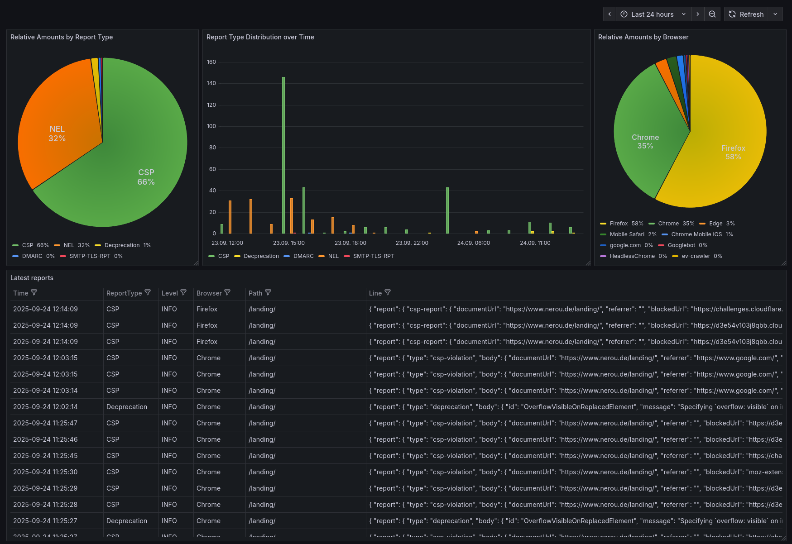

# network-journal Integration Examples

In here you can find some examples on how to integrate network-journal and how to further process your generated logs.

## Grafana Alloy

See [config.alloy](config.alloy) for a config file compatible with Grafana Alloy to parse, index and send your logs to Grafana Loki. 
There you could setup some alerts and graphs showing the different reports.

## Grafana Dashboard

Import [grafana-dashboard.yaml](grafana-dashboard.yaml) into your Grafana instance to get a basic dashboard like this:

